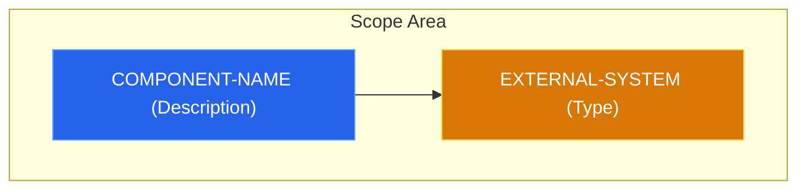

# Architecture Decision Record (ADR) Workflow

This skill defines how to create and format general ADRs. ADRs live in the Second Brain under `~/office/devops/adr/`.

## Workflow for Creating an ADR

1. **Find the next ID**: Look in `~/office/devops/adr/` for the highest numbered prefix (e.g., `0001-xxx.md`) and increment by 1 to get the next ID (e.g., `0002`). If empty, start at `0001`.
2. **Format the filename**: `NNNN-short-descriptive-title.md` (kebab-case). Example: `0001-adopt-flux-for-gitops.md`.
3. **Draft the content**: Use the template below. Replace the placeholders (like `XX` and `[Title]`) with actual content.
4. **Write the file**: Write the finalized content to `~/office/devops/adr/<filename>`.

### Pitfalls
- **Mermaid Parse Errors**: Avoid using unescaped parentheses `()` inside Mermaid edge labels (e.g., `-->|HTTP (Clear Text)|`). This causes a parse error (`Expecting 'SQE' ... got 'PS'`). Either remove the parentheses or wrap the entire label in quotes (e.g., `-->|"HTTP (Clear Text)"|`).

## ADR Template

Always use this exact Markdown structure for the ADR file, including the YAML frontmatter:

```markdown
---
id: "00XX"
title: "[Decision Title]"
status: "proposed" # proposed | accepted | rejected | deprecated | superseded
date: "YYYY-MM-DD"
authors: ["Hugo", "Zeus"]

category: "" # infrastructure | security | observability | application | platform | ci-cd
tags: [] 

drivers: [] 

replaces: "" 
superseded_by: "" 
related_files: [] 
---

# ADR-XXX: [Decision Title]

## Context & Problem Statement
[Describe the current state of the system. What is the specific pain point or trigger that makes this decision necessary right now?]

## Constraints & Assumptions
* [Constraint 1: e.g., Must integrate with existing Auth provider]
* [Constraint 2: e.g., Budget/Time limitations]
* [Assumption: e.g., We assume traffic will not exceed X req/s]

---

## Decision
[Clearly state the chosen solution.]

### Implementation Details
[Specific technical choices, versions, or patterns to be used.]

### System Design Architecture


---

## Alternatives Considered

| Criteria | Option 1 (Selected) | Option 2 |
| :--- | :--- | :--- |
| **Effort** | Low/Medium/High | Low/Medium/High |
| **Scalability** | Scalable | Limited |
| **Verdict** | Best trade-off | Rejected due to [Reason] |

### Option 2: [Name]
* **Description:** [Briefly describe the alternative]
* **Pros:** [Advantage 1, Advantage 2]
* **Cons:** [Disadvantage 1, Disadvantage 2]

---

## Consequences

### Positive
* [Expected improvement 1]
* [Expected improvement 2]

### Negative
* [Technical debt introduced]
* [Added complexity in area X]

### Risks & Mitigations
* **Risk:** [Description of risk]
* **Mitigation:** [How to handle it]

---

## References

- [Links to documentation, issues, or relevant discussions]
```