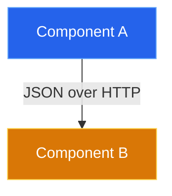

# Architecture Decision Record (ADR) Workflow

This skill defines how to create and format ADRs. ADRs are stored in the `ontology.adrs` table in the Cortex Database (`mnemosyne`) and must be submitted via the PostgREST API over Tailscale. **Do not create local markdown files for ADRs.**

## Workflow for Creating an ADR

1. **Determine the next ID**: Query the PostgREST API to find the highest existing ID.
   `curl -s -H "Accept-Profile: ontology" "http://100.127.157.80/adrs?select=id&order=id.desc&limit=1"`
   Increment the returned ID (e.g., "080" -> "081").

2. **Submit via Python**: It is highly recommended to use Python to construct and send the payload to avoid shell JSON escaping issues with large markdown bodies.

Use `execute_code` or `terminal` with a script like this:

```python
import json
from urllib.request import Request, urlopen
from datetime import datetime

adr_payload = {
    "id": "081",
    "repository": "current-repo-name", 
    "title": "[Decision Title]",
    "status": "proposed", # proposed | accepted | rejected
    "decision_date": datetime.today().strftime('%Y-%m-%d'),
    "category": "architecture", # infrastructure | security | application | platform
    "authors": ["Hugo", "Zeus"],
    "tags": ["tag1", "tag2"],
    "drivers": ["Performance", "Decoupling"],
    "replaces": None,
    "superseded_by": None,
    "related_files": [],
    "content": """# ADR-081: [Decision Title]

## Context & Problem Statement
[Describe the current state and the specific pain point.]

## Constraints & Assumptions
* [Constraint 1]

---

## Decision
[Clearly state the chosen solution.]

### Implementation Details
[Specific technical choices, versions, or patterns.]

### System Design Architecture


---

## Alternatives Considered
* **Option A:** [Description] - Rejected because...
* **Option B:** [Description] - Accepted.

---

## Consequences
### Positive
* [Benefit]
### Negative
* [Drawback]
### Risks & Mitigations
* **Risk:** [Risk] -> **Mitigation:** [Mitigation]
"""
}

# Use POST for new ADRs, or PATCH with ?id=eq.XXX for updates
req = Request("http://100.127.157.80/adrs", data=json.dumps(adr_payload).encode('utf-8'), method='POST')
req.add_header('Content-Type', 'application/json')
req.add_header('Content-Profile', 'ontology')

try:
    with urlopen(req) as response:
        print(f"ADR created successfully: HTTP {response.getcode()}")
except Exception as e:
    print(f"Error: {e}")
```

### Pitfalls
- **Mermaid Parse Errors**: Avoid using unescaped parentheses `()` inside Mermaid edge labels. Wrap the entire label in quotes (e.g., `-->|"HTTP (Clear Text)"|`).
- **Upserting/Editing**: If you need to edit an existing ADR, use the `PATCH` method and append `?id=eq.XXX` to the URL.
- **Schema Header**: Always include `'Content-Profile': 'ontology'` in your POST/PATCH requests, or PostgREST will reject it.